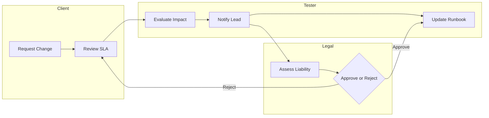

# Task Stack: Pre-Engagement, Governance, and Legal Foundations

> Outcome: Signed-off scope, legal authority, and operational guardrails aligned with UK Cyber Scheme CSTM expectations.

## Task Group 1: Authority Validation
- [ ] Confirm signed **Rules of Engagement (RoE)**; verify version control hash `sha256sum RoE.pdf` and store in `/evidence/governance/`.
- [ ] Validate indemnity and insurance cover notes with legal counsel; record policy numbers in `governance_log.md`.
- [ ] Execute conflict checks and export compliance screening using `python compliance_checker.py --client <name>` (custom tooling).

### Evidence
- Store notarised copies of RoE, Non-Disclosure Agreements, and Data Processing Agreements with checksums.

## Task Group 2: Scope Definition
- [ ] Enumerate in-scope IP ranges using CIDR notation; maintain `scope_networks.csv` with columns `cidr,start_ip,end_ip,notes`.
- [ ] Define out-of-scope assets and business-critical systems; update `scope_exclusions.md` with justification.
- [ ] Construct change-control workflow diagram in Mermaid:

- [ ] For infrastructure changes (jump hosts, VPN headends), cross-reference the [Networking and VPN appendix](Appendix_Networking_and_VPN.md) for standard templates and evidence requirements before submitting change tickets.

### Commands
```bash
# Validate CIDR blocks for typos
python3 - <<'PY'
from ipaddress import ip_network
with open('scope_networks.csv') as fd:
    for line in fd:
        if line.strip() and not line.startswith('cidr'):
            cidr = line.split(',')[0]
            try:
                ip_network(cidr)
            except ValueError as exc:
                print(f"Invalid CIDR {cidr}: {exc}")
PY
```

### Scoping Questionnaire
- **What business objectives or threat scenarios is the client prioritising?** — Capture narrative and priority ranking in the `scope_register.md` artefact alongside any linked risk appetite statements.
- **Which assets, environments, or user groups are explicitly in scope?** — Enumerate identifiers and owners in `scope_register.md`; cross-reference CIDR entries logged in `scope_networks.csv`.
- **What systems or activities are out of scope or require protective handling?** — Record exclusions in `scope_exclusions.md` and flag watch-points for the on-call list inside `escalation_contacts.md`.
- **Which maintenance/change windows, black-out periods, or freeze dates apply?** — Schedule constraints in `scope_register.md` and circulate notifications through the escalation tree documented in `escalation_contacts.md`.
- **What legal, regulatory, or contractual constraints must govern operations?** — Map obligations to control owners in `governance_log.md` and hyperlink to the signed RoE noted in `scope_register.md`.
- **How will success be measured (KPIs, findings thresholds, remediation support)?** — Define acceptance criteria, evidence locations, and report recipients in `scope_register.md`, with escalation triggers aligned to `escalation_contacts.md`.

## Task Group 3: Communications Plan
- [ ] Create escalation matrix with 24/7 contacts; include fallback PSTN numbers and Signal/Matrix IDs.
- [ ] Schedule daily stand-ups via secure conferencing (`/usr/bin/riot-web` or `element-desktop`).
- [ ] Configure encrypted mailboxes using `proton-bridge` or `gpg` managed keys.

### Commands
```bash
# Generate GPG key for engagement
gpg --quick-gen-key "CSTM Engagement Lead <lead@example.com>" rsa4096 encr 2y
# Export public key for client
gpg --armor --export lead@example.com > evidence/governance/lead_pubkey.asc
```

## Task Group 4: Tool Governance
- [ ] Run software bill of materials (SBOM) on core toolset: `syft packages dir:/opt/tools -o json > sbom.json`.
- [ ] Hash binaries and compare against vendor checksums: `sha256sum /opt/tools/* > binaries.sha256`.
- [ ] Document licensing restrictions (e.g., Burp Suite Pro seat IDs) in `tooling_register.md`.

## Task Group 5: Evidence Handling SOP
- [ ] Prepare encrypted evidence repository: `cryptsetup luksFormat /dev/nvme1n1 evidence.luks`.
- [ ] Mount with keyfile: `cryptsetup open --type luks evidence.luks evstore && mount /dev/mapper/evstore /mnt/evidence`.
- [ ] Define retention schedule and purge scripts (e.g., `shred -uvz` for secure deletion).

## Task Group 6: Risk Acceptance and Sign-Off
- [ ] Present test plan to stakeholders; capture minutes via `obsidian` or `joplin` exported to Markdown.
- [ ] Obtain written approval for high-risk attacks (e.g., DoS, destructive testing); store as `approval_<date>.md`.
- [ ] Run final compliance checklist script: `./scripts/cstm_preengagement_audit.sh --output evidence/governance/audit_report.md`.
